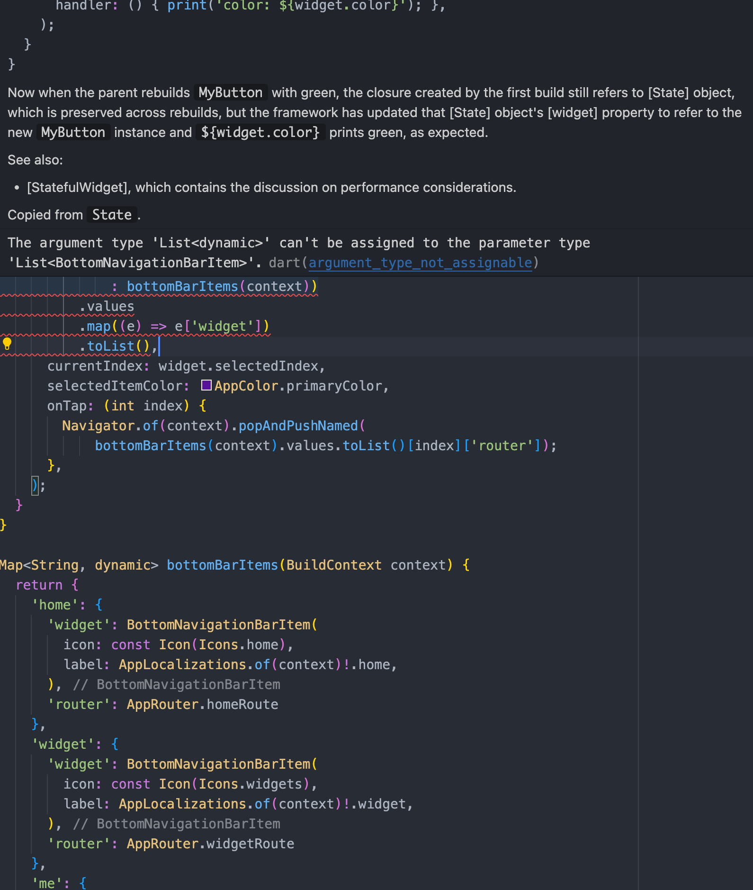

[TOC]

# flutter && dart

> 总结一些新手开发flutter项目碰到的一些坑

## 基础布局

##### Container & SizedBox

如果只是要给组件设置宽高，不需设置对齐样式、背景色和边框样式就用SizedBox,反之则用Container,另外SizedBox也可以用来填充不同组件之间的空白（类似web中的margin），其他的内边距和对齐都可以在Container上设置属性，不建议使用Padding和Align组件。

```dart
...
  const SizedBox(
		width: double.infinity,
  	height: double.infinity,
  	child: ...
	),

  ...
  const Container(
		width: double.infinity, //可以不用设置默认撑满父组件的宽度
  	height: 40,
  	align: Alignment.center,
  	decoration: const BoxDecoration(
      color: Color(0xFF252424),
      border: Border.all(
      	color: Colors.white,
     		width: 1,
      ),
      borderRadius: BorderRadius.all(
        Radius.circular(20),
      ),
    ),
	),
...
```

##### Column & Row

`Column`和`Row`两个组件对应web开发中垂直和水平两种线性布局的方式，特别需要注意的是单独的Column和Row会撑满父容器的宽度，但是如果是Column嵌套Column或者Row嵌套Row，只有最外层的会占用尽可能大的空间，内层的组件占用的是实际的大小，Container的嵌套也是这个原理。

```dart
Column(
  crossAxisAlignment: CrossAxisAlignment.start, //交叉轴的对齐方式
  mainAxisAlignment: MainAxisAlignment.start, //主轴的对齐方式
  children: [
    const SizedBox(
      height: 30,
    ),
    Row(
      children: [
        const SizedBox(
          width: 30,
        ),
        const Icon(
          Icons.account_circle,
          color: AppColor.primaryColor,
          size: 60,
        ),
        const SizedBox(
          width: 20,
        ),
        Text('text'),
        ...
      ],
    ),
    const SizedBox(
      height: 30,
    ),
 	],
)
```


##### Flex

由于Column和Row继承自Flex，所以可以在他们内存的中直接使用Flexible组件进行弹性布局,譬如在上面的Row的children最后加上如下的组件。

```dart
Flexible(
flex: 1,
child: Container(
  alignment: Alignment.centerRight,
  decoration: const BoxDecoration(
    color: Colors.black,
  ), // 设置背景色方便观察组件的宽度
  child: const Text(
    'flex',
    style: TextStyle(color: Colors.white),
  ),
)),
```


##### Stack & Positioned

层叠布局对应web开发中的position:relative和position:absolute，使用方法如下：

```dart
Stack(children: [
  Container(
    height: 100,
    alignment: Alignment.bottomCenter,
    decoration: const BoxDecoration(
      color: AppColor.primaryColor,
    ),
    child: const Text('purple'),
  ),
  Positioned(
    left: 0,
    top: 0,
    // right: 0,
    // bottom: 0,
    child: Container(
      width: MediaQuery.of(context).size.width, //这里必须用媒体查询获取父级的宽度
      height: 50,
      alignment: Alignment.bottomCenter,
      decoration: const BoxDecoration(
        color: Colors.green,
      ),
      child: const Text('green'),
    ),
  ),
  // 越往后的child层级越高，所以在最上层的是黄色的Container
  Positioned(
    left: 0,
    top: 0,
    child: Container(
      width: MediaQuery.of(context).size.width,
      height: 25,
      alignment: Alignment.bottomCenter,
      decoration: const BoxDecoration(
        color: Colors.yellow,
      ),
      child: const Text('yellow'),
    ),
  )
]),
```


## 性能优化和监控

1. 细粒度的UI渲染，由于机制问题，在父组件的build方法中setState会导致子组件的build方法被频繁调用，所以不要再父组件中setState，最好使用Provider/Selector、ValueNotifier对UI进行更精细的操作，保证数据操作没有传染性。

```dart
ValueNotifier<double?> sliderXListener = ValueNotifier<double?>(_sliderX);

...
  ValueListenableBuilder(
    valueListenable: sliderXListener, //这里配置listener
    builder: (BuildContext context, value, child) {
      return Positioned(
        left: _sliderX,
        top: (widget.controller.offset?.dy ?? 0) *
            _scale,
        child: Image.memory(
            gaplessPlayback: true,
            base64Decode(_sliderImg)),
      );
    },
  )
...
```

2. dispose中优化计时器，组件的dispose并不会自动的回收计时器占用的内存必须手动来清除（特殊情况除外，譬如需要定时修改全局provider的需求，要显示未读消息气泡这种）。

```dart
late Timer? _timer;

@override
void dispose() {
  _timer?.cancel(); // 组件destroy的时候释放计时器
  super.dispose();
}
```

3. UI和GPU帧率监控

```dart
...
  MaterialApp(
    showPerformanceOverlay: true, //开启帧率检测
    navigatorKey: navigatorKey,
    ...
  )
...
```


监控模块有两层，上面的是GPU帧率，下方的是UI帧率表示当前帧的绘制时间，红色表示当前帧的绘制时间超过16ms

## Null safety（空安全）

在flutter2.2.0版本之后添加了可空类型和非空断言，跟typescript的`？`差不多。

```dart
// 表示String或者null类型
String? str;

// !就是类型的断言，dart的lint是不会报错的，但是编译会报错，必须try-catch才能过了编译
if(str!.length > 0) {

}
```
## 常见错误分析

1. 

碰到`Invalid constant value`的报错只要查看表达式向上的组件是否被定义成const，移除该修饰符即可

2. 

可空类型的转换和运算需通过`??`操作符设置默认值，此处只需要加加上?? '{}'即可。

3. 

定义StatefulWidget要传递的属性最好是final的不然会warning，但是可以通过编译。

4. 

想要调用toList方法转换成自定义的List<T>,需要将map方法返回的值强制转换一下类型，这里就是`e['widget'] as BottomNavigationBarItem`。

## WebView

基于`webview_flutter`插件，自定义`HybridH5`组件，需要注意的是H5调用App的方法是通过`addJavaScriptChannel`添加postMessage的信道，然后执行回调函数来调用app的方法，而App调用H5页面的方法是直接执行一段Javascript脚本（如果不需要获取返回结果调用`runJavaScript`方法，如果要获取结果则使用`runJavaScriptReturningResult`方法）。

代码如下：

```dart
import 'package:bruno/bruno.dart';
import 'package:flutter/material.dart';
import 'package:flutter_mobile_template/src/constants/colors.dart';
import 'package:oktoast/oktoast.dart';
import 'package:webview_flutter/webview_flutter.dart';

class HybridH5 extends StatefulWidget {
  final String url;
  const HybridH5({super.key, required this.url});

  @override
  State<StatefulWidget> createState() => _HybridH5State();
}

class _HybridH5State extends State<HybridH5> {
  WebViewController controller = WebViewController();
  String title = '加载中...';

  @override
  void initState() {
    super.initState();
  }

  @override
  Widget build(BuildContext context) {
    ValueNotifier<String> titleListener = ValueNotifier<String>(title);
    controller
      // FOCUS 添加js通信channel
      ..addJavaScriptChannel('AppToaster',
          onMessageReceived: (JavaScriptMessage p) {
        showToast(p.message);
      })
      ..setJavaScriptMode(JavaScriptMode.unrestricted)
      ..setBackgroundColor(const Color(0x00000000))
      ..setNavigationDelegate(
        NavigationDelegate(
          onProgress: (int progress) {},
          onPageStarted: (String url) {},
          onPageFinished: (String url) {
            controller.runJavaScript('''
              window.AppToaster.postMessage('toast from flutter!');
            ''');
            controller.runJavaScriptReturningResult('''
              document.title;
            ''').then((value) {
              title = value.toString();
              titleListener.value = value.toString();
            });
          },
          onWebResourceError: (WebResourceError error) {},
          onNavigationRequest: (NavigationRequest request) {
            // 可以自定义拦截规则，比如拦截app://开头的url，这就赋予了webview打开app内部页面的能力
            // if (request.url.startsWith('app://')) {
            //   String routePath = request.url.substring(6);
            //   Navigator.of(context).pushNamed(routePath);
            // }
            return NavigationDecision.navigate;
          },
        ),
      )
      ..loadRequest(Uri.parse(widget.url));

    return Scaffold(
      appBar: BrnAppBar(
        title: ValueListenableBuilder(
            valueListenable: titleListener,
            builder: (BuildContext context, value, child) {
              return Text(title, style: const TextStyle(color: AppColor.white));
            }),
        // automaticallyImplyLeading: false,
        backgroundColor: AppColor.primaryColor,
      ),
      body: WebViewWidget(controller: controller),
    );
  }
}

```

在需要跳转的地方，用`MaterialPageRoute`组件包裹住WebView，直接调用flutter路由跳转方法跳转指定url的h5页面即可。

```dart
... 
	OutlinedButton(
    onPressed: () {
      Navigator.push(
          context,
          MaterialPageRoute( //
              builder: (context) => const HybridH5(
                  url: 'https://www.baidu.com')));
    },
    child: const Text(
      '打开webview',
      style: TextStyle(color: AppColor.primaryColor),
    ),
  )
...
```
