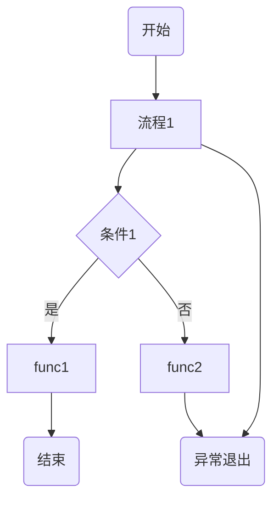
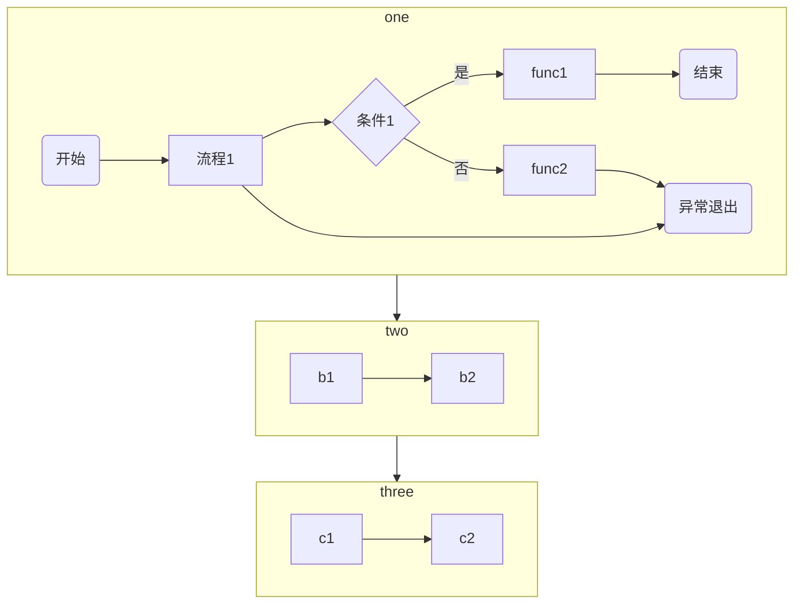
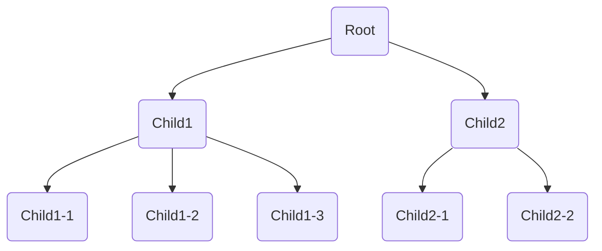
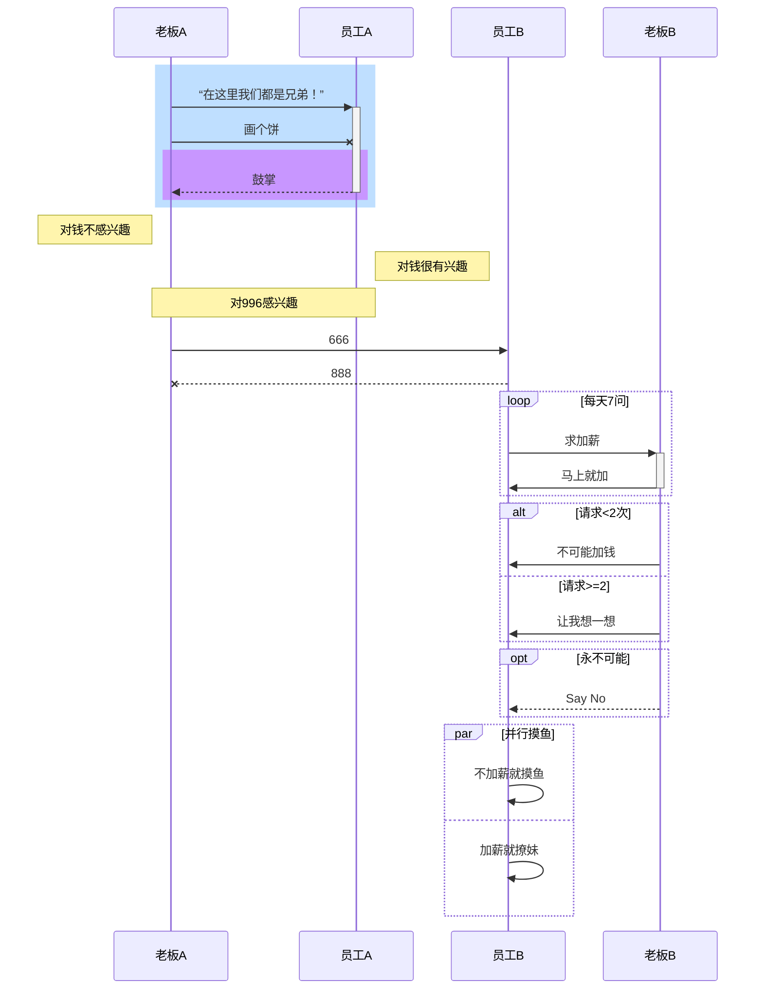
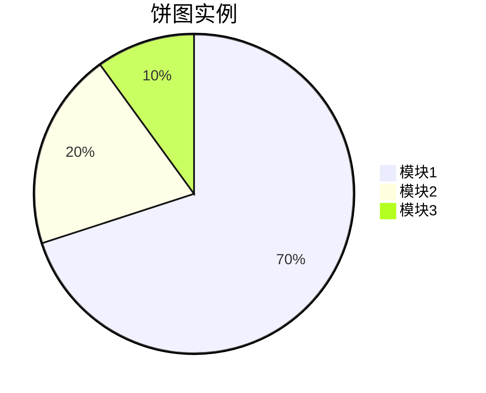

# mermaid插件使用

mermaid是 我们撰写markdown文档时最常用到的图表插件，下面主要介绍一下日常用到的流程图、思维导图、时序图三种图表的常规写法

## 流程图

流程图的声明语法：

1. flowchart声明图表 TB表示从上到下的图，LR代表从左至右的图
2. 声明各个节点的ID、节点类型、节点文案、节点连线是否有文字

> 注意：
>
> 1）圆括号包含的文字在圆角矩形汇总
>
> 2）方括号包含的就在直角矩形中
>
> 3）大括号包含的在棱形中一般表示条件判断
>
> 4）节点ID之前两条竖线包含的文字表示连接线上的文字一般用作条件判断中某个条件的case

#### 简单流程图

```markdown
flowchart TB
A(开始)-->B[流程1]
B-->C{条件1}
C-->|是|D1[func1]
C-->|否|D2[func2]
D1-->Z1
D2-->Z2
B-->Z2
Z1(结束)
Z2(异常退出)
```


#### 包含子流程


> 子流程图可以用作架构层级设计图的绘制

```javascript
flowchart TB
  subgraph sub1[one]
    A(开始)-->B[流程1]
    B-->C{条件1}
    C-->|是|D1[func1]
    C-->|否|D2[func2]
    D1-->Z1
    D2-->Z2
    B-->Z2
    Z1(结束)
    Z2(异常退出)
  end
  subgraph sub2[two]
  	b1-->b2
  end
  subgraph sub3[three]
  	c1-->c2
  end
  sub1 --> sub2
  sub2 --> sub3
```




## 思维导图

> 思维导图的编写方式其实和流程图一致，只是少了条件判断的语法等

```markdown
flowchart TB
A(Root)-->B1(Child1)
A-->B2(Child2)
B1-->C1(Child1-1)
B1-->C2(Child1-2)
B1-->C3(Child1-3)
B2-->D1(Child2-1)
B2-->D2(Child2-2)
```



## 时序图

时序图各标记代表的含义：

- ->>表示实现箭头后面接： 表示内容
- -->>表示虚线箭头一般用来表示相应前面的实现箭头
- -x和--x表示实现箭头但是异步请求，不需要响应
- +,-表示一个激活框，表示时序图上的一段时间
- Note left of, Note right of, Note over 表示注解
- 使用loop，end表示循环的开始和结束
- 使用alt ，else， end表示条件判断
- 使用opt表示可选项，相当于单行的if语句
- 使用par表示并行操作

> 时序图一般表示一个或多个参与者按照时间线的工作流程，在系统架构设计中经常用到

```javascript
sequenceDiagram
participant 老板A
participant 员工A
participant 员工B
participant 老板B
rect rgb(191, 223, 255)
老板A ->> + 员工A : “在这里我们都是兄弟！”
老板A -x 员工A : 画个饼
rect rgb(200, 150, 255)
员工A -->> - 老板A : 鼓掌
end
end
Note left of 老板A : 对钱不感兴趣
Note right of 员工A : 对钱很有兴趣
Note over 老板A,员工A : 对996感兴趣
老板A ->> 员工B : 666
员工B --x 老板A : 888
loop 每天7问
员工B ->> + 老板B : 求加薪
老板B ->> - 员工B : 马上就加
end
alt 请求<2次
    老板B ->> 员工B : 不可能加钱
else 请求>=2
    老板B ->> 员工B : 让我想一想
end
opt 永不可能
    老板B -->> 员工B : Say No
end
par 并行摸鱼
    员工B ->> 员工B : 不加薪就摸鱼
and
    员工B ->> 员工B : 加薪就撩妹
end
```



## 饼图

```javascript
pie title 饼图示例
"模块1": 70
"模块2": 20
"模块3": 10
```




**以上只是mermaid.js的一部分绘图功能展示，更多的可以参考[mermaid官网](https://mermaid-js.github.io/mermaid/#/)**

