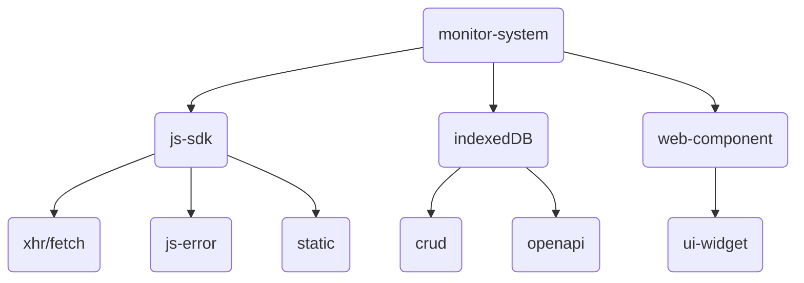
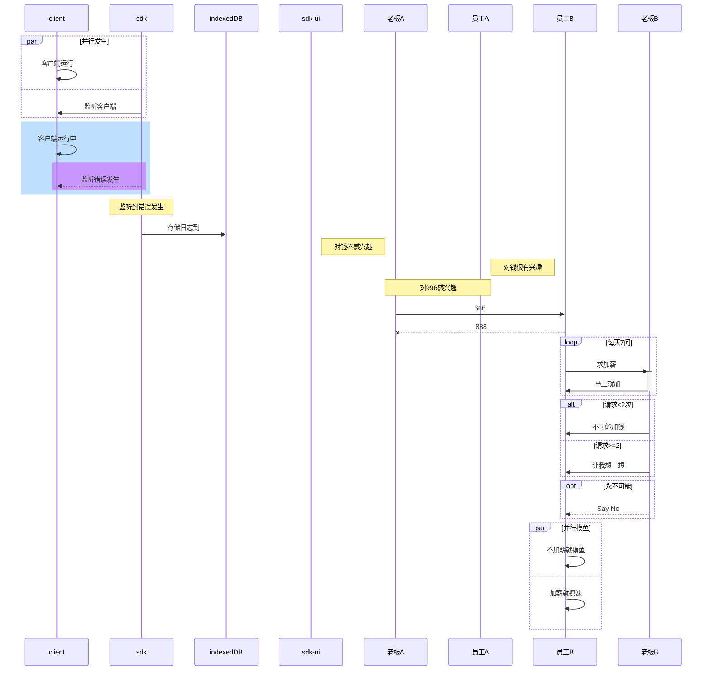

[TOC]

## 前端监控平台

### 背景

最近要做一个前端监控平台，可以实现业务系统的前端错误自动上报和收集，后续还可以接入前端埋点用于业务分析。

针对这个需求就要设计一套完整的系统架构，大致的子系统如下：

### 子系统

### js-sdk（如何收集监控的信息）

日志的上报是有讲究的，不能一有信息就上报这样子如果收集的信息多了就相当于自造了DDOS攻击，所以日志上报的方式最好是先本地存储再择机上报或者直接本地分析日志，这才是好的日志系统需要做到的

### indexDB（监控信息怎么存储和上报，本地版本）

### 性能测试

上报1w条日志需要的存储大小和时间，平均耗时，查询需要耗费的时间，因为只是日志分析的系统只涉及indexedDB的插入和查询，不涉及修改，但是要定时删除过期的日志，而且要控制存储的规模所以对定性有一定的考量，这里一定要仔细考虑清楚才行。

### nestjs（后端版本）

https://www.w3.org/TR/IndexedDB/

https://developer.mozilla.org/zh-CN/docs/Web/API/IndexedDB_API/Using_IndexedDB

https://sentry.io/welcome/
