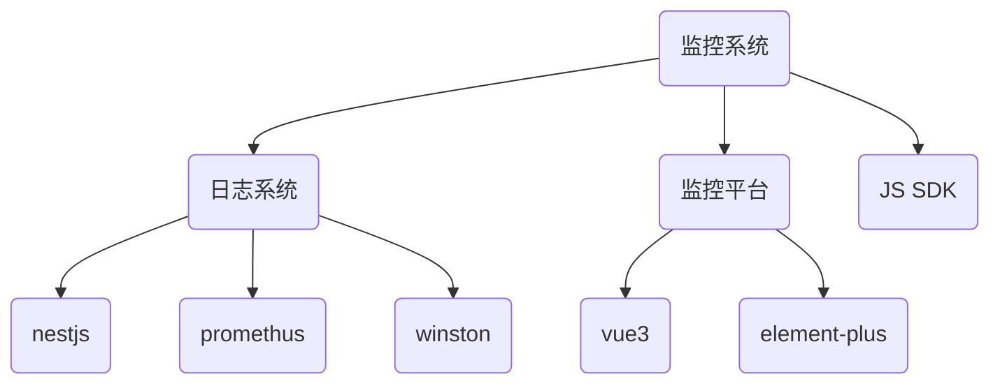

## 前端监控平台

### 背景

最近要做一个前端监控平台，可以实现业务系统的前端错误自动上报和收集，后续还可以接入前端埋点用于业务分析。

针对这个需求就要设计一套完整的系统架构，大致的子系统如下：

### 子系统

```mermaid
flowchart TB
A(监控系统)-->B1(日志系统)
A-->B2(监控平台)
A-->B3(JS SDK)
B1-->C1(nestjs)
B1-->C2(promethus)
B1-->C3(winston)
B2-->D1(vue3)
B2-->D2(element-plus)
```