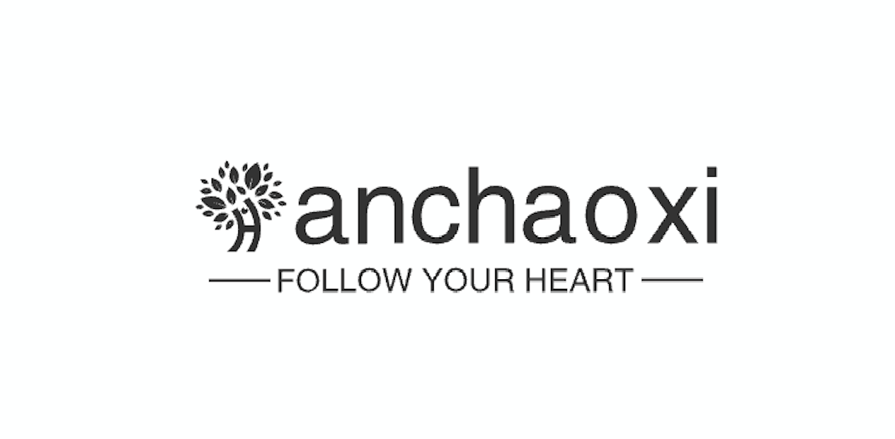

[TOC]

# 前端工具类

> 记录自己在项目开发中经常用到的工具类

## canvas相关

### canvas坐标系中计算两个矩形重合率

```javascript
/**
  计算两个矩形重合率
  @param {object} rect1 -矩形1
  @param {number} rect1.x -矩形1的横坐标
  @param {number} rect1.y -矩形1的纵坐标
  @param {number} rect1.w -矩形1的宽度
  @param {number} rect1.h -矩形1的高度
  @param {object} rect2 -矩形2
  @param {number} rect2.x -矩形2的横坐标
  @param {number} rect2.y -矩形2的纵坐标
  @param {number} rect2.w -矩形2的宽度
  @param {number} rect2.h -矩形2的高度
  @return {number} overlapRate -重合率
*/
function calcOverlapRate(rect1, rect2){
  let commonArea = 0; // 共同面积 // 计算两个矩形的重合区域
  let xStart = Math.max(rect1.x, rect2.x); // 重合区域x起点
  let xEnd = Math.min(rect1.x + rect1.w, rect2.x + rect2.w); // 重合区域y起点 // 重合区域的宽度大于0时，计算重合面积
  if (xEnd > xStart){
    let yStart = Math.max(rect1.y, rect2.y); // 重合区域y，起点
    let yEnd = Math.min(rect1.y + rect1.h, rect2.y + rect2.h); // 重合区域y终点 // 重合区域的高度大于0时，计算重合面积
    if (yEnd > yStart) {
      commonArea = (xEnd-xStart) * (yEnd-yStart);
    }
  } // 将面积转化为重合率
  let totalArea = rect1.w * rect1.h + rect2.w * rect2.h - commonArea;
  let overlapRate = Math.round(commonArea/totalArea * 100) / 100; // 取两位小数
  return overlapRate;
}
```

<a href="https://github.com/cxhan" target="_blank"></a>